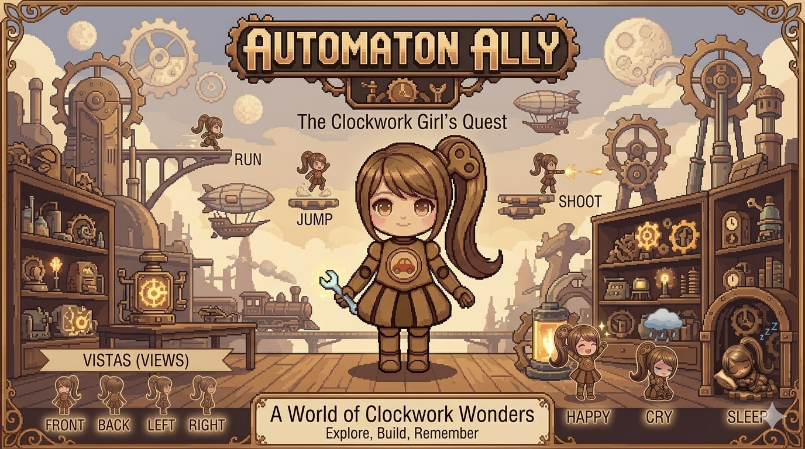
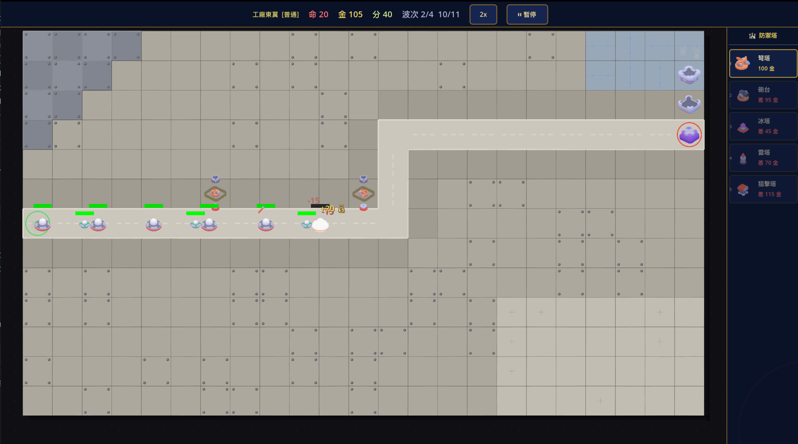

# Coco & the Factory（發條工廠）

> 敘事型塔防遊戲 — Godot 4.6 · 繁體中文/English · Steam 目標上架

一個關於被遺忘的玩具、記憶與愛的塔防遊戲。
你扮演玩具機器人 Coco（AK-0247），守護發條工廠對抗由「渴望」率領的失落玩具軍團。

---

## 📸 截圖





---

## 🗺️ Alpha 路線 — Steam 上架進度

> 選定路線：**Alpha（最快上架）** — 美術 → 音樂 → 教學 → 商店素材
>
> 更新日期：2026-03-14

### A1 · 美術系統替換（Art Overhaul）
目標：替換所有 ColorRect 占位符為真實 Sprite2D

- [x] **下載 Kenney Tower Defense Kit**（免費，CC0）
  - 來源：`assets/kenney_tower-defense-kit/Previews/`（64×64 RGBA PNG，已驗證透明背景）
- [x] **敵人精靈替換**
  - [x] BasicEnemy（小兵）→ `slime_green.png`（AnimatedSprite2D，已有）
  - [x] FastEnemy（斥候）→ `enemy-ufo-b.png`
  - [x] TankEnemy（重甲）→ `enemy-ufo-c.png`
  - [x] BossEnemy（渴望）→ `enemy-ufo-d.png`（scale 1.2×）
- [x] **防禦塔精靈替換**
  - [x] 弩塔 ArrowTower → `tower-round-base` + `weapon-ballista`
  - [x] 砲台 CannonTower → `tower-square-bottom-a` + `weapon-cannon`
  - [x] 冰塔 IceTower → `tower-round-crystals` + `tower-round-top-a`
  - [x] 雷塔 LightningTower → `tower-round-top-b` + `tower-round-build-d`（新增 Turret 旋轉）
  - [x] 狙擊塔 SniperTower → `tower-square-bottom-b` + `weapon-turret`（新增 Turret 旋轉）
- [x] **子彈/投射物精靈替換**
  - [x] ArrowProjectile → `weapon-ammo-arrow.png`
  - [x] CannonProjectile → `weapon-ammo-cannonball.png`
  - [x] IceProjectile → `weapon-ammo-bullet.png`（藍色 modulate）
- [ ] **UI 圖示更新**
  - [ ] 塔選擇面板（TowerPanel）加入塔縮圖
  - [ ] 升級面板圖示
- [x] **TowerPanel 縮圖**（Sprite2D 縮圖卡片，含塔名/費用，不可購買時半透明）
- [x] **地形美化**
  - [x] WorldBackground 智能路徑偵測：直路(H/V)、轉角(SE/SW/NE/NW)、出入口各用對應 Kenney tile
  - [x] 草地隨機混合 tile/tile-bump/tile-rock/tile-tree
  - [x] 背景色填底避免透明邊緣穿幫
  - [ ] 可建造格子高亮視覺升級

### A2 · 背景音樂（Background Music）
目標：主選單、遊玩、Boss 戰各有音樂，AudioManager 已就緒

- [x] AudioManager 支援 `set_music_volume()`、`play_music(stream)`
- [x] 設定畫面音量滑桿（Settings Screen）
- [ ] **取得授權音樂檔案**（建議來源：opengameart.org, freesound.org）
  - [ ] `assets/audio/music/music_menu.ogg` — 主選單主題（輕鬆、神秘）
  - [ ] `assets/audio/music/music_gameplay.ogg` — 遊玩主題（緊張、機械感）
  - [ ] `assets/audio/music/music_boss.ogg` — Boss 戰（強烈、情緒化）
  - [ ] `assets/audio/music/music_victory.ogg` — 勝利音樂（勝利、溫暖）
  - [ ] `assets/audio/music/music_story.ogg` — 劇情畫面（柔和、思鄉）
- [x] **AudioManager 音樂軌道系統** — `play_track(track_name)` 介面已完成
- [x] **各場景接入音樂**
  - [x] MainMenu → "menu" 軌道
  - [x] GameWorld → "gameplay" 軌道
  - [x] StoryScreen → "story" 軌道
  - [x] Boss 波次（最終波）→ 自動切換 "boss" 軌道
  - [x] 勝利畫面 → "victory" 軌道
- [x] **額外音效補充**（來源：Kenney Interface Sounds，CC0）
  - [x] 敵人死亡音效 `sfx_enemy_die.ogg` ← `glass_001.ogg`
  - [x] 放置塔音效 `sfx_tower_place.ogg` ← `drop_002.ogg`
  - [x] 升級音效 `sfx_tower_upgrade.ogg` ← `maximize_002.ogg`
  - [x] 出售塔音效 `sfx_tower_sell.ogg` ← `minimize_002.ogg`
  - [x] 遊戲失敗音效 `sfx_game_over.ogg` ← `error_006.ogg`
  - [x] 勝利音效 `sfx_victory.ogg` ← `confirmation_004.ogg`
  - [x] 敵人到達終點 `sfx_life_lost.ogg` ← `error_001.ogg`

### B1 · 教學系統（Tutorial）
目標：第一次遊玩 Level 1 自動觸發，引導玩家完成核心操作

- [x] **TutorialManager 自動載入節點** — 步驟狀態管理，SaveManager 記錄完成
- [x] **TutorialOverlay 場景** — 高亮框 + 說明文字 + 繼續按鈕
- [x] **教學步驟（6步）**：
  - [x] Step 1：歡迎說明 + 遊戲目標
  - [x] Step 2：選擇防禦塔（高亮 TowerPanel）
  - [x] Step 3：放置防禦塔（高亮格子區域）
  - [x] Step 4：等待波次（說明倒計時）
  - [x] Step 5：點擊塔升級/販售（高亮 UpgradePanel）
  - [x] Step 6：使用加速按鈕
- [x] 完成後永久記錄，不再觸發（`tutorial_done` → SaveManager）
- [x] 可在設定畫面重置教學

### C5 · Steam 商店素材（Store Assets）
目標：準備上架所需的所有 Steam 商店頁面素材

- [ ] **Capsule 主圖**（必要）
  - [ ] Small Capsule：231×87 px
  - [ ] Main Capsule：460×215 px
  - [ ] Header Capsule：460×215 px
  - [ ] Hero Capsule：1128×492 px（可選）
- [ ] **遊戲截圖**（至少 5 張，建議 1920×1080）
  - [ ] 截圖1：主選單畫面
  - [ ] 截圖2：Level 1 遊玩（展示塔防玩法）
  - [ ] 截圖3：劇情對話畫面（Coco 與齒輪爺爺）
  - [ ] 截圖4：Boss 戰（渴望登場）
  - [ ] 截圖5：多塔組合守線（展示策略深度）
- [ ] **遊戲宣傳影片 Trailer**（30–90 秒）
  - [ ] 開場：劇情片段（Coco 覺醒）
  - [ ] 中段：遊玩展示（建塔、升級、敵浪）
  - [ ] 結尾：Boss 戰高潮 + 遊戲標題
- [ ] **商店頁文案**（中英雙語）
  - [ ] 遊戲簡介（150 字內）
  - [ ] 特色列表（5–7 點）
  - [ ] 系統需求
- [ ] **Steam 標籤建議**：Tower Defense, Strategy, Story Rich, Singleplayer, Indie, Casual

---

## 🎮 遊戲現況

### 已完成系統
| 系統 | 狀態 | 說明 |
|------|------|------|
| 核心塔防循環 | ✅ 完整 | 放塔、波次、敵人路徑、傷害 |
| 5 種防禦塔 | ✅ 完整 | 弩塔/砲台/冰塔/雷塔/狙擊塔，各 2 段升級 |
| 4 種敵人 | ✅ 完整 | 小兵/斥候/重甲/渴望(Boss) |
| 5 個主線關卡 | ✅ 完整 | 含 Boss 戰（關 3、關 5） |
| 劇情系統 | ✅ 完整 | 10 段故事 + 尾聲，含角色立繪 |
| 存檔系統 | ✅ 完整 | JSON 本地存檔，高分/解鎖/設定 |
| 成就系統 | ✅ 完整 | 10 個成就 + Toast 通知 |
| 設定畫面 | ✅ 完整 | 音量滑桿、全螢幕切換 |
| 難度選擇 | ✅ 完整 | 簡單/普通/困難，影響生命與金幣 |
| 繁體中文 UI | ✅ 完整 | 全部介面已中文化 |
| 教學系統 | ✅ 完整 | 首次遊玩自動觸發 |
| 音樂架構 | ✅ 完整 | 各場景掛鉤完成，等待音樂檔案 |
| 美術 | ✅ 完整 | Kenney 3D Preview 精靈（64×64 RGBA），塔/敵人/投射物全替換 |
| 音效 SFX | ✅ 完整 | 放塔/升級/出售/死亡/失血/失敗/勝利 7 個 SFX |
| 背景音樂 | ⏳ 等待 | 架構完成，需音樂檔案（.ogg 放入 assets/audio/music/） |
| Steam 商店素材 | ❌ 未開始 | 需美術完成後製作截圖/Trailer |

### 內容量統計
- **關卡數**：5 主線關卡
- **總波次**：26 波
- **塔種類**：5 種，各 2 段升級
- **敵人種類**：4 種
- **劇情場景**：10 段（5前置 + 4後記 + 1尾聲）
- **成就數量**：10 個
- **預估遊玩時長**：首通 2–3 小時

---

## 🏗️ 技術架構

### 自動載入節點（Autoloads）
| 節點 | 職責 |
|------|------|
| `EventBus` | 全域信號匯流排 — 所有跨系統事件 |
| `GameManager` | 遊戲狀態：生命/金幣/分數/速度/難度 |
| `SaveManager` | 存讀檔（JSON → `user://save_data.json`） |
| `SceneManager` | 場景切換（淡入淡出）+ 劇情/設定導航 |
| `AudioManager` | 音樂/音效音量控制、多聲道池 |
| `StoryDatabase` | 劇情資料庫（5前置 + 4後記 + 1尾聲） |
| `AchievementManager` | 成就追蹤 + Toast 通知 |
| `TutorialManager` | 教學步驟管理 |

### 信號流（Signal Flow）
```
BaseEnemy._die()
  → EventBus.enemy_died(gold, score)
      → GameManager.add_gold()
      → HUD 更新金幣/分數
      → WaveManager 追蹤存活數
      → AchievementManager 累計擊殺

GameWorld._try_place_tower()
  → EventBus.tower_placed(tower, tile)
      → HUD 更新
      → AchievementManager 累計建塔
      → TutorialManager 推進教學步驟
```

### 資料驅動設計
```
data/levels/level_N.tres  ─► LevelData（路徑、波次組合）
data/towers/*.tres        ─► TowerData（傷害、射程、升級）
data/enemies/*.tres       ─► EnemyData（血量、速度、護甲）
```

---

## 🚀 開發環境

### 需求
- [Godot 4.6](https://godotengine.org/download/)（標準版，非 Mono/C#）

### 執行方式
```bash
git clone <repo>
# 在 Godot 4.6 開啟 project.godot
# 按 F5 執行
```

---

## 📁 專案結構

```
project.godot
scripts/
  autoloads/          # 8 個全域單例
  resources/          # TowerData, EnemyData, WaveData, LevelData...
  towers/             # BaseTower + 5 種塔腳本
  enemies/            # BaseEnemy + 4 種敵人腳本
  projectiles/        # 子彈腳本
  ui/                 # 所有 UI 控制器
  game_world.gd       # 遊玩場景主控
  wave_manager.gd     # 波次生成與計時
  grid_manager.gd     # 格子狀態與渲染
scenes/
  MainMenu.tscn
  LevelSelect.tscn
  GameWorld.tscn
  StoryScreen.tscn
  SettingsScreen.tscn
  towers/             # 5 種塔場景
  enemies/            # 4 種敵人場景
  ui/                 # HUD, PauseMenu, Victory, GameOver...
data/
  towers/             # 5 個 TowerData .tres
  enemies/            # 4 個 EnemyData .tres
  levels/             # 5 個 LevelData .tres
assets/
  audio/              # 音效（4個），音樂（待填入）
  sprites/            # 精靈（待替換為 Kenney）
```

---

## 🎨 美術資源說明

### 當前狀態
全部使用 `ColorRect` 色塊作為占位符，可正常遊玩但無法用於商業發行。

### 建議資源包
**Kenney Tower Defense Kit**（CC0 免費）
- 下載：https://kenney.nl/assets/tower-defense-kit
- 放置：`assets/sprites/kenney/`
- 包含：塔底座、塔頭、子彈、敵人、地形磚塊、UI 元件

### 替換步驟
每個場景（如 `ArrowTower.tscn`）：
1. 選中 ColorRect 節點
2. 改為 Sprite2D
3. 設定 `texture` 為對應精靈
4. 調整 `offset` 讓中心對齊

---

## 🎵 音樂需求

| 檔名 | 用途 | 風格建議 |
|------|------|----------|
| `music_menu.ogg` | 主選單 | 輕鬆、神秘、帶機械齒輪感 |
| `music_gameplay.ogg` | 一般戰鬥 | 緊張、節拍穩定，適合策略思考 |
| `music_boss.ogg` | Boss 波次 | 強烈、史詩感、情緒化 |
| `music_victory.ogg` | 勝利畫面 | 溫暖、希望感 |
| `music_story.ogg` | 劇情對話 | 柔和、鋼琴或環境音 |

建議來源：
- https://opengameart.org（免費、Creative Commons）
- https://freemusicarchive.org
- https://www.zapsplat.com

---

## 🏷️ Steam 上架資訊（計畫中）

| 項目 | 計畫內容 |
|------|----------|
| 定價 | $4.99–$7.99（視內容完成度調整） |
| 語言 | 繁體中文（完成）、英文（計畫中） |
| 分類標籤 | Tower Defense, Strategy, Story Rich, Indie |
| 目標評級 | 普遍級（E / 全齡） |
| 預計上架 | TBD |

---

## 📄 授權

- 遊戲程式碼：MIT License
- Kenney 美術資源：CC0 1.0（公共領域）
- 故事文本版權歸原作者所有
